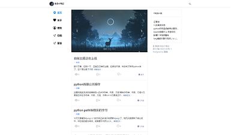

# 一款三栏、清新、个性的 typecho 主题

`lanstar`
为什么会有这个名称呢，其实很简单，中文名是蓝星，而因为blue star有些奇怪，所以有个这个，在我百度翻译的时候，神奇的发现这个被识别为布列塔尼语， 翻译是兰星，差不多，好巧

目前的功能特性，包含了好多，具体可以看博客的介绍，当然也没有列全，可以下载体验我的主题看看。

2020-8-20-[最初的介绍](https://dyedd.cn/806.html)

2023-1-04-[Lanstar4：锐意新生 自砍三刀](https://dyedd.cn/935.html)

[演示地址](https://dyedd.cn)

当然也欢迎土豪们的投资

